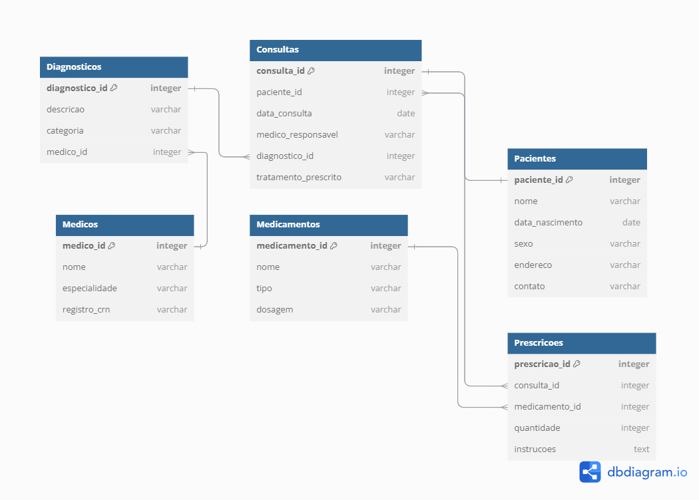

# Projeto de Data Engineering - Gestão de Saúde Pública
O sistema de Gestão de Saúde Pública foi pensado para oferecer um cuidado mais próximo e eficiente às pessoas. Ele tem como objetivo facilitar o acompanhamento do histórico médico de cada paciente, registrando consultas, diagnósticos, tratamentos e prescrições de forma organizada e acessível.
A ideia é criar um espaço onde profissionais de saúde e pacientes possam contar com informações centralizadas, garantindo um cuidado mais atento e personalizado. Assim, será possível acompanhar a evolução das condições de saúde, planejar tratamentos com mais eficiência e oferecer um suporte mais humano e acolhedor em cada etapa do cuidado.
Este projeto tem como objetivo implementar um pipeline de dados para a gestão de saúde pública, utilizando dados fictícios sobre pacientes, médicos, diagnósticos, medicamentos, e consultas médicas. O pipeline vai desde a ingestão de dados em um ambiente relacional até a criação de dashboards interativos para visualização dos KPIs.

## Estrutura do Projeto
- **Banco de Dados Relacional**: Estrutura com as tabelas `Pacientes`, `Consultas`, `Médicos`, `Diagnósticos`, `Medicamentos` e `Prescrições`.
- **Pipeline de Dados**: Conduz os dados através das camadas `Landing`, `Bronze`, `Silver` e `Gold` em um Data Lake.
- **Dashboard**: Visualização dos KPIs e métricas com gráficos interativos.

## Tabelas no Banco de Dados
- **Pacientes**: Contém informações sobre os pacientes, como nome, data de nascimento, sexo, etc.
- **Consultas**: Detalhes das consultas médicas realizadas pelos pacientes.
- **Médicos**: Dados dos médicos responsáveis pelas consultas.
- **Diagnósticos**: Informações sobre diagnósticos médicos.
- **Medicamentos**: Medicamentos prescritos durante as consultas.
- **Prescrições**: Detalhes das prescrições realizadas, incluindo quantidade e instruções.

### Modelo de Dados
O modelo de dados abaixo representa a estrutura do banco de dados relacional utilizado neste projeto. Ele descreve as tabelas e suas relações, fundamentais para o gerenciamento de informações como pacientes, médicos, consultas e prescrições.

<div align="center">
  
</div>


## Tecnologias Utilizadas
- **Banco de Dados Relacional** (MySQL/PostgreSQL)
- **Apache Spark** (para transformação de dados)
- **Metabase / Google Data Studio** (para criação de dashboards)
- **Docker** (para ambientes locais)
- **MkDocs** (para documentação)
- **GitHub Pages** (para hospedagem da documentação)

## Começando
Essas instruções permitirão que você obtenha uma cópia do projeto em operação na sua máquina local para fins de desenvolvimento e teste.
### Pré-requisitos
Antes de começar, verifique se você tem as seguintes dependências instaladas:
- **Git**: Para clonar o repositório. Você pode instalar o Git a partir de [aqui](https://git-scm.com/).
- **Python**: Certifique-se de ter a versão mais recente de Python instalado. Você pode verificar a instalação com `python --version` .
### Clonando o repositório
1. Abra o terminal ou prompt de comando.

2. Clone o repositório para sua máquina local com o seguinte comando:
   ```bash
   git clone https:https://github.com/jzpacheco/trabalho-eng-dados
   ```
   
3. Navegue até o diretório do projeto:
   ```bash
   cd trabalho-eng-dados
   ```

## Desenho de Arquitetura
Coloqui uma imagem do seu projeto, como no exemplo abaixo:


## Pré-requisitos
De que coisas você precisa para instalar o software e como instalá-lo?

```
Dar exemplos
```

## Instalação
Uma série de exemplos passo-a-passo que informam o que você deve executar para ter um ambiente de desenvolvimento em execução.
Diga como essa etapa será:

```
Dar exemplos
```

E repita:

```
Até finalizar
```

Termine com um exemplo de como obter dados do sistema ou como usá-los para uma pequena demonstração.

## Implantação
Adicione notas adicionais sobre como implantar isso em um sistema ativo
=======
## Ferramentas utilizadas

Ferramentas utilizadas.

* [Visual Studio Code](https://code.visualstudio.com/) - Editor de código-fonte poderoso com suporte a várias linguagens e extensões.
* [Python](https://www.python.org/) - Linguagem de programação versátil e amplamente utilizada em ciência de dados, automação e desenvolvimento web.
* [Power BI](https://powerbi.microsoft.com/) - Ferramenta de análise de dados da Microsoft, utilizada para criar relatórios e dashboards interativos.

## Colaboração
Por favor, leia o [COLABORACAO](https://gist.github.com/usuario/colaboracao.md) para obter detalhes sobre o nosso código de conduta e o processo para nos enviar pedidos de solicitação.

Se desejar publicar suas modificações em um repositório remoto no GitHub, siga estes passos:

1. Crie um novo repositório vazio no GitHub.
2. No terminal, navegue até o diretório raiz do projeto.
3. Execute os seguintes comandos:

```bash
git remote set-url origin https://github.com/jzpacheco/trabalho-eng-dados
git add .
git commit -m "Adicionar minhas modificações"
git push -u origin master
```

Isso configurará o repositório remoto e enviará suas modificações para lá.

## Versão
Atualmente, o projeto encontra-se em fase de desenvolvimento inicial, com foco na implementação das principais funcionalidades descritas na estrutura do sistema. Não há um controle formal de versões aplicado até o momento. As alterações e melhorias estão sendo feitas de forma incremental, conforme as demandas do pipeline e do banco de dados.  
### Status Atual
O projeto já apresenta os seguintes avanços:  
- Criação do banco de dados relacional com tabelas estruturadas para `Pacientes`, `Consultas`, `Médicos`, `Diagnósticos`, `Medicamentos` e `Prescrições`.  
- Pipeline de dados em desenvolvimento, conduzindo informações entre as camadas `Landing`, `Bronze`, `Silver` e `Gold`.  
- Planejamento inicial para os dashboards interativos, com definição de KPIs e métricas de saúde pública.
### Planejamento Futuro
- Finalizar e otimizar o pipeline de dados, garantindo integridade e consistência das informações.
- Desenvolver dashboards interativos para exibição dos KPIs.
- Implementar um esquema de controle de versões formal (como SemVer) para melhor acompanhamento do progresso e das funcionalidades do projeto.  
### Como Acompanhar o Progresso
Para acompanhar as mudanças realizadas, consulte o histórico de commits diretamente no repositório.

## Autores
* **Alexandre Hermes** - [https://github.com/Alexandre200319](https://github.com/Alexandre200319)
* **Gabriel Angelo Kaufmann** - [https://github.com/GabrielAKaufmann](https://github.com/GabrielAKaufmann)
* **Jefferson Barzan Alexandrino** - [https://github.com/JeffAlexandrino](https://github.com/JeffAlexandrino)
* **Jefferson Zeferino Pacheco** - [https://github.com/jzpacheco](https://github.com/jzpacheco)

## Licença
Este projeto foi desenvolvido como parte de um trabalho acadêmico e é destinado exclusivamente para fins educacionais. O uso, modificação ou distribuição sem permissão prévia não é autorizado.

## Referências
Cite aqui todas as referências utilizadas neste projeto, pode ser outros repositórios, livros, artigos de internet etc.
